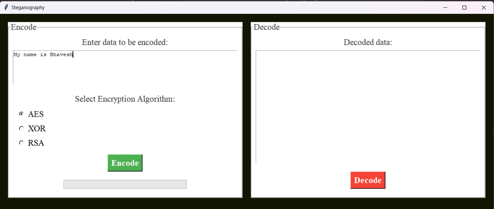
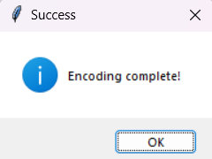
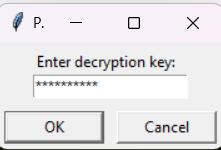
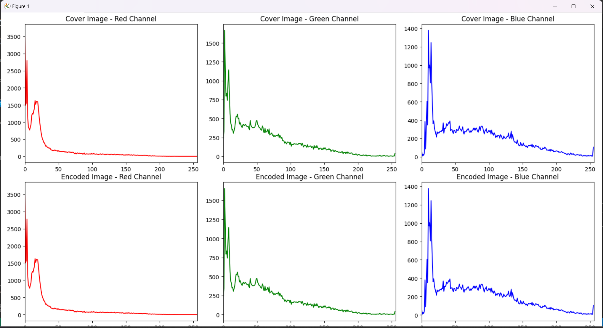

# 🔐 Encryption-Based Image Steganography

This project provides a **GUI tool** for encoding and decoding hidden messages within images using steganography techniques. For added security, the encoded messages are encrypted using various algorithms such as **AES**, **XOR**, and **RSA**.

## ✨ Features

- **Steganography**: Conceals data within an image by altering pixel values.
- **Encryption Algorithms**:
  - 🔒 **AES**: Advanced Encryption Standard (128-bit key size).
  - 🔑 **XOR**: Simple XOR encryption with a custom key.
  - 🔐 **RSA**: Asymmetric encryption using public and private key pairs.
- **Password Strength Validation**: Ensures that encryption passwords are strong and secure.
- **Image Comparison**: Displays the original and encoded images side-by-side, with histograms for visual comparison.
- **Private Key Management**: Generates, saves, and loads RSA private keys for encryption and decryption.

## 📋 Requirements

- **Python 3.7** or higher
- **Libraries**:
  - `tkinter`
  - `Pillow`
  - `matplotlib`
  - `cryptography`
  - `numpy`
  - `re`
  - `os`

Install the required dependencies using:

```bash
pip install Pillow matplotlib cryptography numpy
```

## 🚀 Usage

### 🔷 Encode a Message
1. Select an image file (`.png`, `.jpg`, `.jpeg`).
2. Enter the text you want to encode.
3. Choose an encryption algorithm:
   - **AES**: Enter a password for encryption.
   - **XOR**: Enter a custom password.
   - **RSA**: Automatically generates a public/private key pair.
4. Click **Encode**.
5. Save the newly encoded image.
6. View the original and encoded images side-by-side, along with histograms.


### 🔷 Decode a Message
1. Select the encoded image file.
2. Choose the encryption algorithm used during encoding.
3. Enter the decryption key:
   - For **RSA**, load the private key (`.pem` file).
   - For **AES** and **XOR**, enter the key used during encoding.
4. Click **Decode**.
5. The hidden message will be displayed.



### 🔑 Password Entry and Validation
For AES and XOR, you will be prompted to enter the decryption key as shown below.



Additionally, the password strength validator ensures that your password is strong and meets the required criteria:



## 🔑 Password Strength Validator

For **AES** and **XOR**, the password is validated against the following criteria:
- At least 8 characters long
- Contains at least one uppercase letter
- Contains at least one digit
- Contains at least one special character

## 🛠️ RSA Key Management
- **Private Key Generation**: RSA private and public keys are generated when RSA is selected for encryption.
- **Save Key**: The private key can be saved as a `.pem` file for later use.
- **Load Key**: During decoding, the private key is required for decryption.

## 🖼️ GUI Overview
- **Encode Section**: Input the data to be encoded, choose the encryption method, and embed it into the selected image.
- **Decode Section**: Select an encoded image, choose the decryption algorithm, and retrieve the hidden data.
- **Image Comparison**: Visualize differences between the original and encoded images, both side-by-side and using RGB histograms.



## 📊 Image Histograms
The tool provides a comparison of histograms between the cover image and the encoded image for each RGB channel, allowing you to analyze the subtle differences.


## 🌟 Future Enhancements
- Support for additional file formats.
- Improve performance for encoding/decoding larger images.
- Add more advanced encryption algorithms.

## 📄 License
This project is open-source and available under the **MIT License**.
